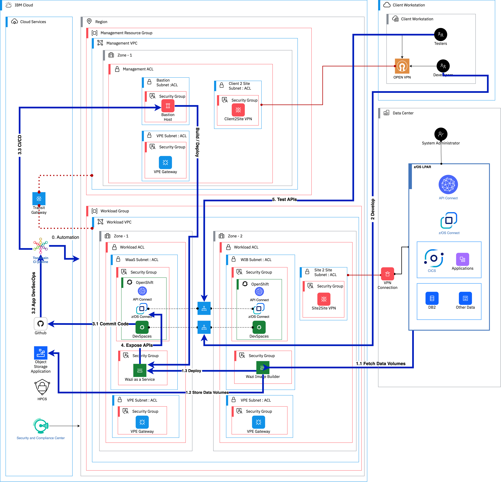

---

copyright:
  years: 2023
lastupdated: "2023-11-07"

subcollection: zmodernization-fscloud

keywords:

---

{{site.data.keyword.attribute-definition-list}}

# System architecture overview
{: #architecture}

{: caption="Figure 1. System architecture overview" caption-side="bottom"}

## Components
{: #components}

The following major components are included in the architecture.

1. On-premises zSystems – should be collocated near the {{site.data.keyword.cloud_notm}} data centers. zSystems applications like CICS, Db2, WebSphere MQ, and other apps run on the network where the firewalls and site-to-site VPN to {{site.data.keyword.cloud_notm}} exists. Application modernization runs with a z-Connect to expose the functions of legacy applications through API Gateway like API Connect. A custom image is taken from the on-premises zSystem for the development or test environment. All the data is encrypted during the in-transit and at-rest.
2. Wazi Image Builder (WIB) – is a tool that takes the data volumes from on-premises zSystems and creates a custom image that can be used to initiate a Wazi VSI instance on {{site.data.keyword.cloud_notm}}. WIB resides in {{site.data.keyword.cloud_notm}} and collects all the selected raw data volumes from the on-premises zSystems. WIB uses Cloud Object Storage to store the data volumes and the custom image. The custom image is created by system admin of the zSystems using WIB. WIB runs on an Intel x86 VSI instance on {{site.data.keyword.cloud_notm}}.
3. Wazi-as-a-Service (WaaS) - Accelerate cloud native development and testing of z/OS applications with z/OS Virtual Server in {{site.data.keyword.cloud_notm}} Virtual Private Cloud (VPC). It's your own protected space in the {{site.data.keyword.cloud_notm}} with the security of a private cloud and the agility of a public cloud. IBM Wazi aaS also provides experimental capabilities to enable customers to get started with exploring {{site.data.keyword.cloud_notm}}’s Continuous Delivery offering through Integration templates based on DevSecOps practices. The service offers a unified user experience for z/OS and cloud native applications in the {{site.data.keyword.cloud_notm}} to create and use toolchains, with security and auditability at its core.
4. Development workspace - IBM Wazi Developer for Workspaces provides the z/OS application development capabilities in the OpenShift Container Platform environment. After the cluster administrator of your organization completes the installation, each z/OS application developer on the team can create a development workspace. Then, the z/OS application developer can edit, build, and debug mainframe applications from any machine without any local environment configurations.
5. z-Connect - Simplify working with APIs by using IBM z/OS Connect and benefit from the following capabilities:
     1. Interact with z/OS applications and data by using APIs that conform to the OpenAPI 3.0 specification. 
     2. Develop a IBM z/OS Connect API starting from an existing OpenAPI 3.0 specification definition 
     3. Transform z/OS data with functional mapping capabilities and feature-rich tools.
     4. Deploy IBM z/OS Connect APIs as isolated secure microservices, driving agility across the enterprise.
     5. Take advantage of the improved security schemes provided by the OpenAPI 3.0 specification to deliver more granular control of user authorization at the API operation level.
     6. Use Red Hat OpenShift Dev Space, Red Hat OpenShift Wazi Dev Space or make the z/OS Connect Designer image available on your image registries for self-service use with an OCI-compliant container run time. For example, Podman, or Docker Desktop V19.0.3 or higher.
     7. Develop APIs in your own IBM z/OS Connect development environment that contains an isolated IBM z/OS Connect development server.
     8. Use JSONata, a powerful data transformation language to enhance your API mapping.
     9. Manage API projects across your teams by using your choice of Source Control Management (SCM) systems.
     10. Your CICS COBOL applications can call APIs that conform to the OpenAPI 3.0 specification through IBM z/OS Connect.
6. Cloud Pack for Integration (CP4I) - IBM Cloud Pak for Integration offers a simplified solution to this integration challenge, allowing the enterprise to modernize its processes while positioning itself for future innovation. API Connect - Create, secure, manage, share, and monetize APIs across clouds while you maintain continuous availability. Take control of your API ecosystem and drive digital business with a robust API strategy that can meet the changing needs of your users.
7. Financial Service Cloud (FS Cloud) – IBM Cloud Framework for Financial Services is designed to help address the needs of financial services institutions with regulatory compliance, security, and resiliency during the initial deployment phase and with ongoing operations. The framework also helps to simplify the ability of financial institutions to transact with ecosystem partners who deliver software or SaaS applications, and who meet the requirements of the framework. The IBM Cloud Framework for Financial Services consists of:
      1. A comprehensive set of control requirements designed to help address the security requirements and regulatory compliance obligations of financial institutions and cloud best practices. The cloud best practices include a shared responsibility model across financial institutions, application providers, and {{site.data.keyword.cloud_notm}}.
      2. Detailed control-by-control guidance for implementation and supporting evidence to help address the security and regulatory requirements of the financial industry.
      3. Reference architectures designed to facilitate compliance with the control requirements. In addition, resources are provided to deploy infrastructure as code in order to automate the deployment and configuration of the reference architectures.
      4. Tools and IBM services, such as {{site.data.keyword.cloud_notm}} Security and Compliance Center, to enable parties to efficiently and effectively monitor compliance, remediate issues, and generate evidence of compliance.
      5. Ongoing governance of the framework documentation that considers new and changing regulations, as well as bank and public cloud requirements.
8. Bastion Host – A Jump Host or a Bastion host is used to allow access to {{site.data.keyword.cloud_notm}} ToolChain for running the DevOps through automation scripts for the build and deployment of applications on Wazi VSI instance. The Bastion Host should allow network ACL from ToolChains TCP/IP to run the scripts. Because the {{site.data.keyword.cloud_notm}} ToolChain service is a public-facing service a Bastion Host is required to deploy the applications. The Bastion Host is isolated by having its own subnet ACLs and Security Groups. 

## Workflow
{: #workflow}

### Step 0:  Deploying FS Cloud framework by using a deployable architecture
{: #step0}

Using guided user interface and automation, you can use a deployable architecture to setup the environment for mainframe application in a given region. The deployable architecture provides a layout with Management VPC and Workload VPC. The management VPC has resources like Bastion Host specific to managing the VSIs and other resources in workload VPC and has restricted access to users that are trusted to some degree. The workload VPC has the resources like Wazi as a Service VSI, and other x86 VSI instances to accommodate optional Wazi Image Builder as per client requirements. The workload VPC also provides optional ROKS (Red Hat OpenShift) clusters to run IBM Z Mod Stack tools to modernize the applications by using developer tools. The Workload VPC also has VPE (Virtual Private Endpoint) Gateways to access the {{site.data.keyword.cloud_notm}} services through private IP addresses avoiding use of public network access for security. A configurable Site to Site VPN gateway is created to allow on-premises network traffic that is connected to {{site.data.keyword.cloud_notm}} securely. A transit gateway is created to connect Management VPC to Workload VPC. All the Network ACL defined for both Workload and Management VPC are by default that is configured to not allow public network connectivity making t an isolated network like an air-gap environment. Security and Compliance can be integrated to Cloud Framework to monitor, audit, and alert with pre-defined and customizable industry compliance controls.

### Step 1: Wazi Image Builder extracts the data volumes to build a custom image.
{: #step1}

Wazi Image Builder can be installed on an x86_64 Linux® system hosted either in a cloud or an on-premises physical or virtual machine. The following steps show the functions of WIB:

1.1	- Fetch the z/OS System Context with data volumes
1.2	- Store all the data volumes in Cloud Object Storage
1.3	- WIB uses deployment scripts that use a terraform to build the custom image and deploy to Wazi as a Service instance

### Step 2: Developer workspace is enabled for secure DevSecOps
{: #step2}

Developer Workspace provides Visual Studio IDE to enable the developers to remotely use the service and create workspace with on-demand basis. Developer workspace is deployed in the ROKS cluster by installing the operator and making minor configuration changes per the requirements. Developer Workspace integrates with Git repositories for source controls and continuous integrations and deployments. The CI/CD pipeline is used which uses bastion host to build and deploy the code on to Wazi VSI instance in a secure setup. Below steps describe the CI/CD deployment of application development, build, and deployments.

### Step 3: Deploy with CI/CD pipeline
{: #step3}

3.1	– A developer commits their code on Developer Workspace VS IDE
3.2	– A CI/CD deployment with guided setup enables you to trigger the build and deployment of an application on to Wazi instance that uses Bastion Host

### Step 4: You can extend and expose the Mainframe application by using z/OS Connect APIs
{: #step4}

Developers can extend the functions of a mainframe application to external services by creating APIs by using z/OS Connect module. The z/OS Connect module can be containerized in Red Hat OpenShift Cluster or can be used within the Wazi VSI instance. Here we show the containerized version. An OpenAPI application is developed by using the developer workspace and integrated with a mainframe application running in Wazi instance that uses z/OS Connect. The will enhance the applications to modularize without disrupting the functions of the core applications and extending to external enterprise services.

### Step 5: Testing the functions
{: #step5}

Testers can test the functions of the mainframe application either through exposed APIs or on the Wazi instance itself.

