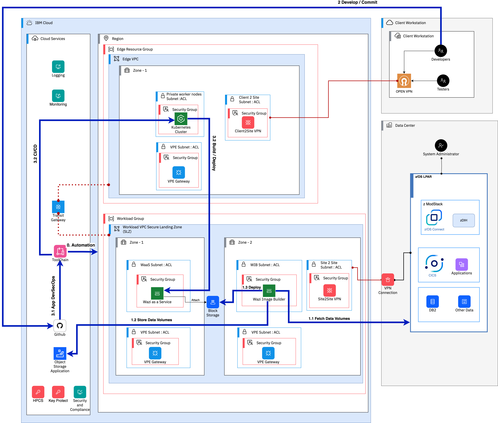

---

copyright:
  years: 2023
lastupdated: "2023-11-07"

subcollection: zmodernization-fscloud

keywords:

---

{{site.data.keyword.attribute-definition-list}}

# System architecture overview
{: #architecture}

## Workflow
{: #workflow}

{: caption="Figure 1. System architecture overview" caption-side="bottom"}

### Step 0:  Deploying FS Cloud framework by using a deployable architecture
{: #step0}

Using a guided user interface and automation, you can use a deployable architecture to set up the environment of mainframe applications for a given region. The deployable architecture provides a layout with Edge VPC and Workload VPC. The Edge VPC has resources like Private Worker Nodes to access the VSIs and other resources in workload VPC and maintain restricted access to trusted users to some degree. The workload VPC has the resources like Wazi as a Service VSI, and other x86 VSI instances to accommodate optional Wazi Image Builder as per client requirements. The Workload VPC also has VPE (Virtual Private Endpoint) Gateways to access the {{site.data.keyword.cloud_notm}} services through private IP addresses to avoid public network access for security. A configurable Site to Site VPN gateway will allow on-premises network traffic connected to {{site.data.keyword.cloud_notm}} securely is provided. A transit gateway will connect Management VPC to Workload VPC is created. All the Network ACLs are defined for Workload and Management VPC to restrict public network connectivity and to isolate the network like an air-gap environment. Security and Compliance is integrated into Cloud Framework to monitor, audit, and alert with pre-defined and customizable industry compliance controls.

### Step 1: Wazi Image Builder extracts the data volumes to build a custom image.
{: #step1}

Wazi Image Builder installed on an x86_64 Linux® system can be hosted either in a cloud or an on-premises physical or virtual machine. The following steps show the functions of WIB:

1.1	- Fetch the z/OS System Context with data volumes

1.2	- Store all the data volumes in Cloud Object Storage

1.3	- 1.3 - WIB uses deployment scripts that use terraform to build the custom image and deploy to IBM Cloud VPC Block Storage, which is attached to Wazi as a Service instance

### Step 2: Developer workspace is enabled for secure DevSecOps
{: #step2}

Developer integrates with Git repositories for source controls and continuous integrations and deployments. The CI/CD pipeline uses private worker nodes on the Kubernetes cluster to build and deploy the code on to Wazi VSI instance in a secure setup. The following steps describe the CI/CD deployment of application development, build, and deployment.

### Step 3: Deploy with CI/CD pipeline
{: #step3}

3.1	– A developer commits their code VS IDE

3.2	– A CI/CD deployment with guided setup will trigger the build and deployment of an application on to Wazi instance that uses private worker nodes

