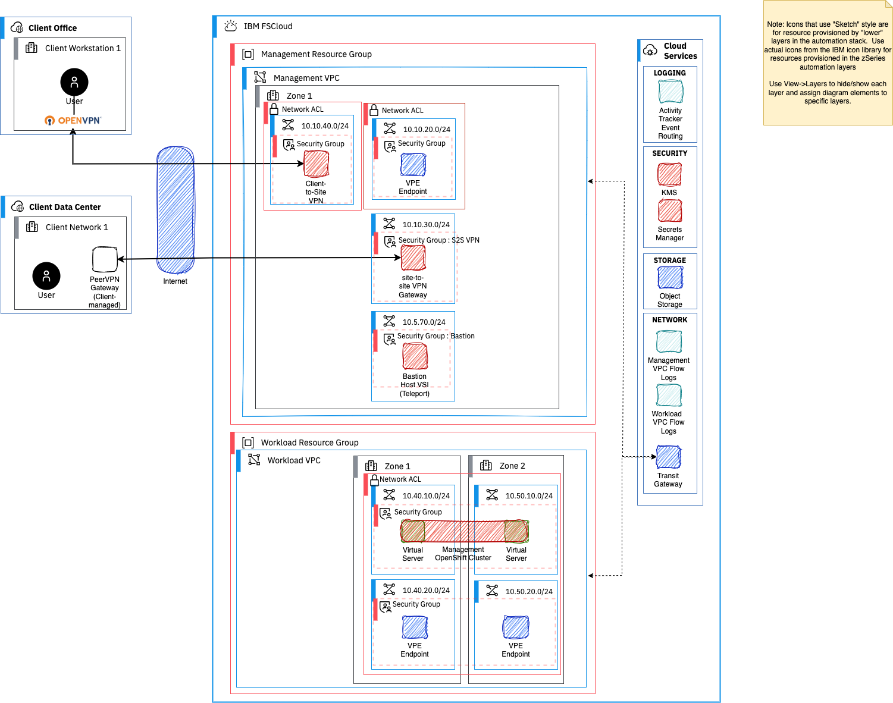

---

copyright:
  years: 2023
lastupdated: "2023-11-07"

subcollection: zmodernization-fscloud

keywords:

---

{{site.data.keyword.attribute-definition-list}}

# Deployable architecture
{: #deployable-architecture}

{: caption="VPC deployable architecture" caption-side="bottom"}

## FAQs
{: #faqs}

1. In EPX how do we customize the SLZ VSI pattern to build a quick start for Wazi instance?

2. Why do we have management VPC?

3. Can we run the Deployable Architecture for mainframe applications in private cloud or corporate  network access?

Documentation on schematics that can run on private environment 
https://cloud.ibm.com/docs/schematics?topic=schematics-agents-intro
