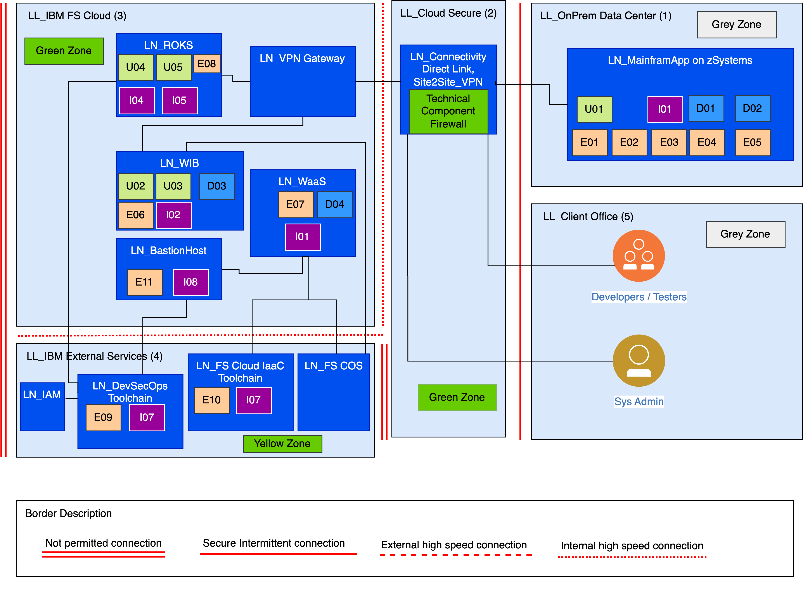

---

copyright:
  years: 2023
lastupdated: "2023-11-07"

subcollection: zmodernization-fscloud

keywords:

---

{{site.data.keyword.attribute-definition-list}}

# Operational Model
{: #operational-models}

In this section we define the logical operational model and physical operational model.

The initial view of locations is listed in the following table:

| Location ID | Description              |
|-------------|--------------------------|
| LL_01       | LL_OnPrem Data Center    |
| LL_02       | LL_Cloud Secure          |
| LL_03       | LL_IBM FS Cloud          |
| LL_04       | LL_IBM External Services |
| LL_05       | LL_Client Office         |
| LL_06       | LL_Public Internet       |
{: caption="Table 1. Locations" caption-side="bottom"}

## Logical location model
{: #logical-location-model} 

The following diagram shows a logical location view (model) 

{: caption="Figure 1. Logical location view" caption-side="bottom"}

The logical locations are mapped to security zones in the logical operational view later in this document. We use the IBM standard for modelling security zones. The following table shows a summary of the zone model.

| Zone   | Type                | Description                                                                                                                                                                                                                                                                                                                                                                                                                                                                                                                     |
|--------|---------------------|---------------------------------------------------------------------------------------------------------------------------------------------------------------------------------------------------------------------------------------------------------------------------------------------------------------------------------------------------------------------------------------------------------------------------------------------------------------------------------------------------------------------------------|
| Red    | Uncontrolled        | Red zones represent uncontrolled environments outside the control of an organization – generally the Internet, but can also include telephone switch networks, ATMs, and so on. The Internet is represented by a red zone, and all Customer access comes through red.                                                                                                                                                                                                                                                           |
| Yellow | Controlled          | Yellow zones control access to “outsiders” (for example, customers). An internet-facing DMZ is an example of a yellow zone. Yellow zones usually has a moderately high level of network traffic control in and out. Yellow zones typically contain front-end components, such as load balancers, web proxies, or other components, which are accessed directly from a red zone.                                                                                                                                                 |
| Green  | Secured             | Green zones permit access only to a small group of highly trusted users and also tightly control network traffic. There might also be multiple secured areas, and access to one secured area does not necessarily give you access to another area. Green zones are never exposed directly to users, and instead are accessed through front-end components in yellow or blue zones.                                                                                                                                              |
| Blue   | Restricted          | A blue zone restricts access to users that are trusted to some degree (for example employees and contractors and other internal staff but not general customers). Generally, a blue zone classification applies to an organization’s intranet infrastructure. A significant amount of customer processing and data might reside in such a zone, including front-end components and application infrastructure. Certain components might reside in a blue zone to facilitate administrative access to other solution components. |
| Gray   | External Controlled | A gray zone is an external zone that is dedicated to a Business Partner or other external entity, where users are identified, but security policies are not strictly applicable (for example, an extranet). Outsourced services where the partner accesses internal network resources (such as applications that reside in a Blue zone) through an extranet is an example where gray zones might exist in a solution design.                                                                                                    |
{: caption="Table 2. Zone model" caption-side="bottom"}

## Deployment unit (DU) model
{: #deployment-unit}

| Subsystem               | Component         | Presentation DU        | Data DU                            | Execution DU                 | Installation DU               | Comments |
|--------------------------|-------------------|------------------------|------------------------------------|------------------------------|-------------------------------|----------|
| Mainframe Application    |                   |                        |                                    |                              |                               |          |
|                          | CICS App          |                        |                                    | E01: CICS_APP                | I01: MainframeApp             |          |
|                          | Java App          |                        |                                    | E02: Java_APP                | I01: MainframeApp             |          |
|                          | EventService      |                        | D01: Message                       | E03: Data store              | I01: MainframeApp             |          |
|                          | Data store        |                        | D02: AppData                       | E04: Relational Database     | I01: MainframeApp             |          |
|                          | Functional APIs   | U01_API                |                                    | E05: APIs                    | I01: MainframeApp             |          |
| Wazi Image Builder (WIB) |                   |                        |                                    |                              |                               |          |
|                          | Portal View       | U02_WIB UI             |                                    |                              | I02: WIB_App                  |          |
|                          | Cloud Integration | U03_Cloud UI           |                                    |                              | I02: WIB_App                  |          |
|                          | Object Storage    |                        | D03: Data Volumes and Custom Image | E06: Cloud Object Storage    | I02: WIB_App                  |          |
| Wazi as a Service (WaaS) |                   |                        |                                    |                              |                               |          |
|                          | Custom Image      |                        | D04: Data Volumes                  | E07: Block Storage           | I01: MainframeApp             |          |
| Dev Spaces               |                   |                        |                                    |                              |                               |          |
|                          | Workspace         | U04_VS SDK             |                                    | E08: ROKS                    | I04: Wazi Dev Spaces Operator |          |
| z/OS Connect             |                   |                        |                                    |                              |                               |          |
|                          | API               | U05_z/OS API Dev Space |                                    | E08: ROKS                    | I05: z/OS Connect Designer    |          |
| Tool Chain               |                   |                        |                                    |                              |                               |          |
|                          | DevSecOps         |                        |                                    | E09: Wazi App CI/CD pipeline | I07: Terraform                |          |
|                          | FS Cloud IaaC     |                        |                                    | E10: FS framework IaaC       | I07: Terraform                |          |
| Bastion Host             |                   |                        |                                    |                              |                               |          |
|                          | Bastion Service   |                        |                                    | E11: Wazi Deploy Scripts     | I08: Shell                    |          |
{: caption="Table 3. Deployment unit model" caption-side="bottom"}

## Logical operational model
{: #logical-operation}

{: caption="Figure 2. Logical operation model" caption-side="bottom"}

