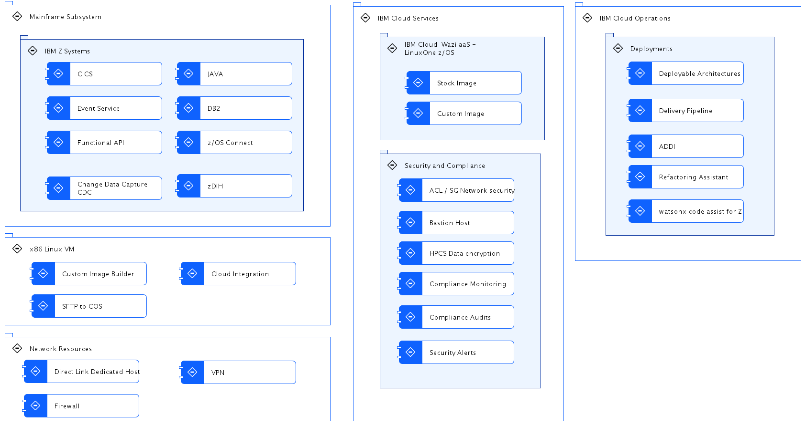

---

copyright:
  years: 2023
lastupdated: "2024-03-25"

subcollection: zmodernization-fscloud

keywords:

---

{{site.data.keyword.attribute-definition-list}}

# Service View
{: #service-view}

The following major components are included in the architecture.

{: caption="Figure 1. Service View" caption-side="bottom"}

## Mainframe Resources
{: #mainframe-resources}

1. IBM zSystems – should be collocated near the {{site.data.keyword.cloud_notm}} data centers. zSystems applications like CICS, Db2, WebSphere MQ, and other apps run on the network where the firewalls and site-to-site VPN to {{site.data.keyword.cloud_notm}} exists. Application modernization runs with a z-Connect, zDIH, CDC to expose the functions of legacy applications through API Gateway like API Connect. A custom image is taken from the on-premises zSystem for the development or test environment. All the data is encrypted during the in-transit and at-rest.
2. x86 Linux VM for Wazi Image Builder – is a tool that fetch the data volumes from zSystems and creates a custom image that can be used to initiate a Wazi VSI instance on {{site.data.keyword.cloud_notm}}. WIB resides in {{site.data.keyword.cloud_notm}} and collects all the selected raw data volumes from the on-premises zSystems. WIB uses Cloud Object Storage to store the data volumes and the custom image using SFTP. The custom image is created by system admin of the zSystems using WIB. WIB runs on an Intel x86 VSI instance on {{site.data.keyword.cloud_notm}}.

## IBM Cloud Wazi Services
{: #cloud-services}

1. Wazi-as-a-Service (WaaS) - Accelerate cloud native development and testing of z/OS applications with z/OS Virtual Server in {{site.data.keyword.cloud_notm}} Virtual Private Cloud (VPC). It's your own protected space in the {{site.data.keyword.cloud_notm}} with the security of a private cloud and the agility of a public cloud. IBM Wazi aaS also provides experimental capabilities to enable customers to get started with exploring {{site.data.keyword.cloud_notm}}’s Continuous Delivery offering through Integration templates based on DevSecOps practices. The service offers a unified user experience for z/OS and cloud native applications in the {{site.data.keyword.cloud_notm}} to create and use toolchains, with security and auditability at its core.

## Security and Compliance
{: #security-compliance}

3. Security and Compliance with Financial Service Cloud (FS Cloud) – IBM Cloud Framework for Financial Services is designed to help address the needs of financial services institutions with regulatory compliance, security, and resiliency during the initial deployment phase and with ongoing operations. The framework also helps to simplify the ability of financial institutions to transact with ecosystem partners who deliver software or SaaS applications, and who meet the requirements of the framework. The IBM Cloud Framework for Financial Services consists of:
    1. A comprehensive set of control requirements designed to help address the security requirements and regulatory compliance obligations of financial institutions and cloud best practices. The cloud best practices include a shared responsibility model across financial institutions, application providers, and {{site.data.keyword.cloud_notm}}.
    2. Detailed control-by-control guidance for implementation and supporting evidence to help address the security and regulatory requirements of the financial industry.
    3. Reference architectures designed to facilitate compliance with the control requirements. In addition, resources are provided to deploy infrastructure as code in order to automate the deployment and configuration of the reference architectures.
    4. Tools and IBM services, such as {{site.data.keyword.cloud_notm}} Security and Compliance Center, to enable parties to efficiently and effectively monitor compliance, remediate issues, and generate evidence of compliance.
    5. Ongoing governance of the framework documentation that considers new and changing regulations, as well as bank and public cloud requirements.
4. Bastion Host – A Jump Host or a Bastion host is used to allow access to {{site.data.keyword.cloud_notm}} services and admins for running the scripts and also to build and deploy applications on Wazi VSI instance.

## IBM Cloud Operations
{: #cloud-operations}

1. Deployable Architectures - Creating secure, compliant, and scalable application infrastructure can be difficult to set up and costly to maintain. Instead of figuring out how to assemble a compliant infrastructure architecture on your own, you can review the deployable architectures. A deployable architecture is cloud automation for deploying a common architectural pattern that combines one or more cloud resources, and it is designed for easier deployment, scalability, and modularity. Each deployable architecture is built and maintained by IBM Cloud experts and follows IBM Cloud best practices. They remove the guesswork from the architecture design process and reduce the time that it takes to deploy complex reference patterns that are secure by default for regulated industries like financial services.
2. Delivery pipeline - IBM Cloud Continuous Delivery provides toolchains, pipelines, and tool integrations. Use toolchains to gain an integrated set of tools to build, deploy and manage your apps. You can create toolchains that include IBM services, open source tools or third-party tools that make development and operations repeatable and easier to manage.
3. ADDI - IBM Application Discovery and Delivery Intelligence (ADDI) is an analysis tool that helps visualize applications, data and jobs on z/OS.
4. IBM watsonx Code Assistant for Z Refactoring Assistant - IBM watsonx Code Assistant for Z Refactoring Assistant is a tool that helps developers identify parts of an application to refactor into modular and reusable services.
5. watsonx code assist for Z - IBM watsonx™ Code Assistant for Z is a generative AI-assisted product. This product provides an end-to-end application developer lifecycle that includes application discovery and analysis, automated code refactoring and COBOL to Java conversion.

