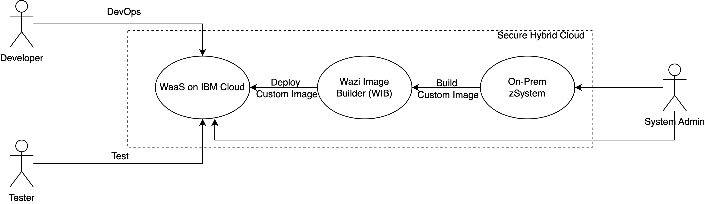

---

copyright:
  years: 2023
lastupdated: "2023-11-07"

subcollection: zmodernization-fscloud

keywords:

---

{{site.data.keyword.attribute-definition-list}}

# System context
{: #system-context}

A custom image is created from the on-premises zSystem to deploy into WaaS on {{site.data.keyword.cloud_notm}} by using the Wazi Image Builder tool.
{: shortdesc}

The custom image is stored in the IBM Cloud Object Storage service. The WaaS instance is created from a custom image that is stored in Cloud Object Storage. {{site.data.keyword.cloud_notm}} services like Wazi as a Service, Red Hat OpenShift on IBM Cloud, Key Protect / HPCS, Cloud Object Storage, and Security and Compliance Center are all provisioned through an industry standard framework automation that is secure and financial services compliant. Developers and Testers work in a closed and segregated hybrid environment not allowing any public internet. A DevOps toolchain and deployable architecture are provided to create the whole solution in an on-demand basis.

{: caption="Figure 1. System context" caption-side="bottom"}

The following table shows the list of human and system actors that interact.

| Actor              | Type                                                                                                                  | Nature of their usage                                                                                                                                       | Location or Environment               |
|--------------------|-----------------------------------------------------------------------------------------------------------------------|-------------------------------------------------------------------------------------------------------------------------------------------------------------|---------------------------------------|
| System Admin       | Person                                                                                                                | Interacts with on-premises zSystems to build custom images by using Wazi Image Builder and deploy into target environments like Cloud Object Storage and Wazi aaS on {{site.data.keyword.cloud_notm}}.           | on-premises data center                   |
| Developer          | Person                                                                                                                | Maintains the application code and performs CI/CD operations that use {{site.data.keyword.cloud_notm}} Toolchain services to deploy onto WaaS instance and on-premises zSystems. | In on-premises offices or a remote location |
| Tester             | Person                                                                                                                | Who test the functions and performance of the applications that’s running on WaaS.                                                                       | In on-premises offices or a remote location |
| On-premises zSystem    | The system that has the production or pre-prod setup with multiple components like COBAL / DB2 / Assembler / MQ. | A custom image is created from this system to simulate the environment on WaaS for development and testing.                                                  | On-premises data center                   |
| Wazi Image Builder | System                                                                                                                | A tool that takes the volumes from source zSystem and create custom image for target environment.                                                        | IBM Cloud VPC Colo                    |
| Cloud Admin        | Person                                                                                                                | Managing the cloud resources, security, and compliance                                                                                                        | IBM Cloud                             |
{: caption="Table 1. Human and system actors" caption-side="bottom"}

