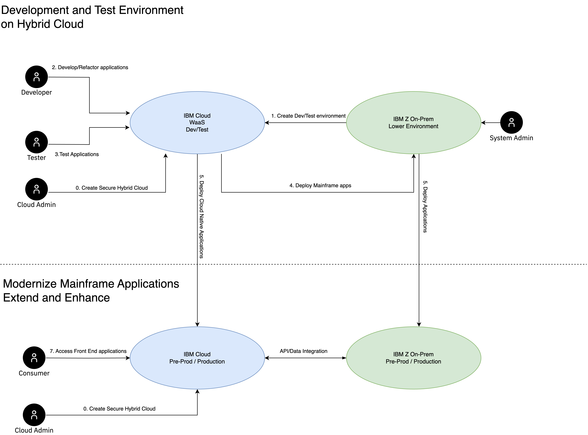

---

copyright:
  years: 2023
lastupdated: "2023-11-07"

subcollection: zmodernization-fscloud

keywords:

---

{{site.data.keyword.attribute-definition-list}}

# System context
{: #system-context}

The system context diagram describes the steps to address various business use case scenarios. The solutions are described as reference architecture patterns and can be achieved through hybrid cloud and co-location strategy.  
{: shortdesc}

{: caption="Figure 1. System context" caption-side="bottom"}

The steps in Figure 1 describes a hybrid cloud solution to, rehost and emulate on cloud for development, refactoring and testing as well as to extend and co-exist with cloud native applications. 

### Step 0:
A cloud admin creates a hybrid cloud environment through automation. IBM Cloud provides automation using Infrastructure as Code with a verified pre-defined templates for regulated industries also know as [Deployable Architectures](https://cloud.ibm.com/catalog#reference_architecture). These are derived from reference architecture patterns designed for financial and regulated industries also know as [IBM Cloud Framework for Financial Services](https://cloud.ibm.com/docs/framework-financial-services?topic=framework-financial-services-about#ibm-cloud-framework-for-financial-services)

### Step 1:
To optimize the cost with consumption based pricing you can run your development and test environments by bringing your on-prem z-systems onto IBM Cloud Z system a.k.a [Wazi aaS](https://www.ibm.com/cloud/wazi-as-a-service). Components like [Wazi Image Builder](https://www.ibm.com/docs/en/wazi-aas/1.0.0?topic=bringing-your-own-image-wazi-image-builder) will allow you to build a custom image from your source on-prem Z System and deploy it to target Wazi instance on IBM Cloud. System Admin will help in identifying the components and data volumes of the applications running on Z

### Step 2:
Developer use the Development and Test environment setup using Wazi aaS to perform their development tasks. A developer may preform refactoring of the mainframe applications, enhancing the mainframe application by converting from COBOL to Java using [watsonx code assistant for Z WCA4Z](https://www.ibm.com/watsonx).

### Step 3:
Testers will run their test cases on the Wazi instance where the developers have deployed their changes.

### Step 4:
DevSecOps pipelines in IBM Cloud allows you to perform test/build/deploy. Business may run their DevOps based on the use cases. Existing source control management like Endevor can be used and deployed on dev/test Wazi environment on IBM Cloud through secure networking. Refactoring and Enhancing of the mainframe applications can be performed using the IBM ToolChain pipeline with Continuous Integration, Continuous Deployment and Continuous Compliance.

### Step 5:
Enhanced applications like Java and other integrated cloud native components are deployed using IBM Tool Chain on IBM Cloud services like Code Engine, OpenShift platforms.

### Step 6:
Integrating on-prem IBM Z core systems with cloud services is available through zModStack tools on IBM Z system with z/OS like [z/OS Connect](https://www.ibm.com/products/zos-connect) and [zDIH](https://www.ibm.com/products/z-digital-integration-hub)

### Step 7:
Consumers can access the front facing applications without any access to core on-prem Z system through a secure and compliant regulated environment. This follows the reference architecture patterns described in [Deployable Architectures](https://cloud.ibm.com/catalog#reference_architecture)

The following table shows the list of human and system actors that interact.

| Actor                       | Type                                                                                                                  | Nature of their usage                                                                                                                                                                               | Location or Environment         |
|-----------------------------|-----------------------------------------------------------------------------------------------------------------------|-----------------------------------------------------------------------------------------------------------------------------------------------------------------------------------------------------|---------------------------------|
| Cloud Admin                 | Person                                                                                                                | Managing the cloud resources, security, and compliance                                                                                                                                              | IBM Cloud                       |
| System Admin                | Person                                                                                                                | Interacts with on-premises zSystems to build custom images by using Wazi Image Builder and deploy into target environments like Cloud Object Storage and Wazi aaS on {{site.data.keyword.cloud_notm}}. | on-premises data center             |
| Developer                   | Person                                                                                                                | Maintains the application code and performs CI/CD operations that use {{site.data.keyword.cloud_notm}} Toolchain services to deploy onto WaaS instance and on-premises zSystems.                    | In on-premises offices or a remote location |
| Tester                      | Person                                                                                                                | Who test the functions and performance of the applications that’s running on WaaS.                                                                                                                  | In on-premises offices or a remote location |
| On-premises zSystem         | The system that has the production or pre-prod setup with multiple components like COBAL / DB2 / Assembler / MQ. | A custom image is created from this system to simulate the environment on WaaS for development and testing.                                                                                         | On-premises data center             |
| IBM Cloud Wazi aaS Dev/Test | System                                                                                                                | On-Demand pay as you go system for Development and Testing.                                                                                                                                         | IBM Cloud VPC                   |
| IBM Cloud Production        | System                                                                                                                | IBM Cloud production environment for cloud native applications that are securely integrated with IBM Z on On-Prem                                                                                   | IBM Cloud VPC                   |
{: caption="Table 1. Human and system actors" caption-side="bottom"}

