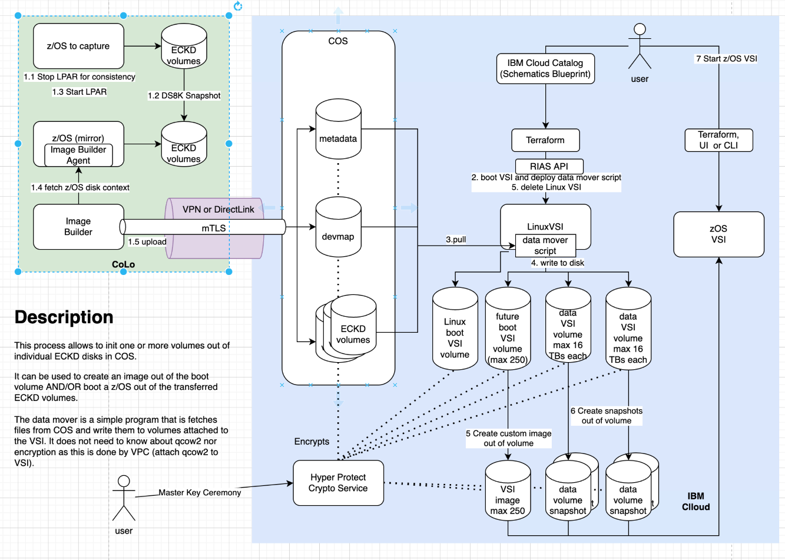
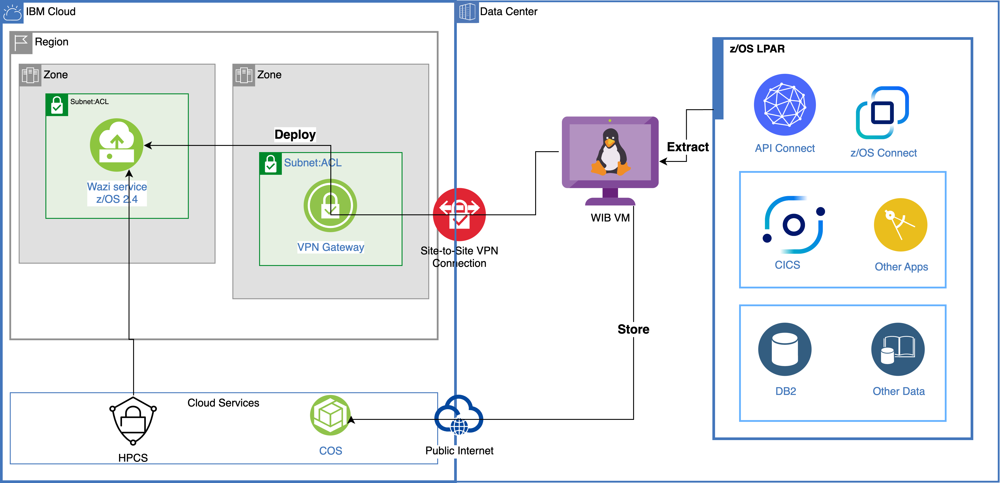

---

copyright:
  years: 2023
lastupdated: "2023-11-07"

subcollection: zmodernization-fscloud

keywords:

---

{{site.data.keyword.attribute-definition-list}}

# Wazi Image Builder
{: #wazi-image-builder}

Wazi Image Builder can be installed on an x86_64 Linux® system hosted either in a cloud or an on-premises physical or virtual machine.

For a complete list of hardware and software requirements, you can generate the report from [Software Product Compatibility Reports](https://www.ibm.com/software/reports/compatibility/clarity/index.html?_gl=1*wnno5o*_ga*MTc3MTkyNDE0OC4xNjkyODI5OTM5*_ga_FYECCCS21D*MTY5NDY3MjAzMC41Mi4xLjE2OTQ2NzIxNjYuMC4wLjA.){: external}.

## Storage server requirements
{: #storage-server-reqs}

To install and run Wazi Image Builder, a storage server to host the artifacts, such as z system volumes and metadata must be set up. To transfer volumes images files from the storage server or to the storage server, you must choose SFTP as the transferring method.

* Disk space. Sufficient space is needed to hold numerous and potentially large files for extracted IBM® Z volumes.
* Software requirements
   * A running SFTP server
   * Terraform - It needs to be installed on the machine that is running Wazi Image Builder
* SFTP server

## Target z/OS system requirements
{: #target-z-reqs}

- Supported z/OS® versions: V2.4 and V2.5.**
   - You must install all the PTFs that are identified with the SMP/E FIXCAT of IBM.TargetSystem-RequiredService.AlternateHypervisors. Installation of all these PTFs must be completed on the z/OS system before you complete the extractions and deploy the custom image.
- You need to install ZD&T z/OS Extraction Utilities to create components from IBM Z® platforms.
- The TCP/IP profile must contain the following values:
   - z/OS IP address: This value must be defined in either the HOME or INTERFACE statement. Using system symbolic parameters for the IP address is not supported.
   - z/OS default route address: This value must be defined by using the `BEGINRoutes` statement. Using system symbolic parameters for the default route is not supported. Routing configurations through `OMPROUTE` are also not supported.

## Wazi Image Builder architecture
{: #wazi-image-builder-architecture}

{: caption="Figure 1. Wazi Image Builder architecture" caption-side="bottom"}

This diagram describes the functions of Wazi Image Builder (WIB) to extract the volumes and build a custom image.

### Prerequisites before building a custom image
{: #prereqs-custom-image}

* Install image builder agent on z/OS system (link to line #34)
* Since we cannot build the custom image with all the data volumes as it exceeds the 300 GB size limit we have to use Cloud Object Storage in cloud to store the data volumes and build snapshots.
* Require a cloud API Key with access to VPC services, Resource Groups and Cloud Object Storage

You can optionally run sanitize image step that uses ZVDT or ZD&T tool on-premises with a z/OS running on LinuxONE or emulated x86.
{: note}

### Building a custom image with Wazi Image Builder
{: #build-custom-image}

1. Step 1: Fetch and upload the z/OS System Context onto IBM Cloud Object Storage.
1. Step 2: WIB calls a terraform script that will create a x86 VSI instance on IBM Cloud.
1. Step 3: The data mover script pulls the image volumes from Cloud Object Storage and persists to VPC block storage.
1. Step 4: The data mover script creates the custom image and data volume snapshots and deletes the VSI instance.

### Provisioning Wazi as a Service VSI instance on IBM Cloud that uses custom image
{: #provision-wazi}

1. Step 1: Create a z/OS VSI in cloud console
1. Step 2: Change the image under the "Image and Profile" section to a custom image
1. Step 3: Create Data Volume under the storage section by importing the snapshot created by WIB. The name of the snapshot would be similar to the custom image.
1. Step 4: Create the instance by filling the rest of the properties similar to x86 VSI

## Architecture decisions
{: #architecture-decisions}

### Option 1: Wazi Image Builder on-premises VM
{: #option1}

{: caption="Figure 2. Wazi Image Builder on-premises VM" caption-side="bottom"}

**Pros**

- Completely managed by Clients for security 
- Close to zSystem Prod and Pre-Prod environment

**Cons**

- Copying your custom image for use by Wazi aaS requires sending data from an on-prem system to your IBM VPC using the public internet via HTTPS.
   - it might require an on-premises firewall rule to open the outbound traffic
   - Cannot use site-to-site VPN.
- Cannot be in a deployable architecture with on-demand provisioning.
- The network latency for copying both volumes into Cloud VSI and VPC might take a lot of time.

### Option 2: Wazi Image Builder on IBM Cloud VSI
{: #option2}

{: caption="Figure 3. Wazi Image Builder IBM Cloud VSI" caption-side="bottom"}

In this approach, you are using a cloud native resources and services.

**Pros**

- Can be added to a deployable architecture with low maintenance cost.
- Can be secured by using FS Cloud framework security principles (HPCS/KeyProtect, Compliance Checks, Network isolation and so on).
- Much faster as its close to cloud storage with private access.

### Option 3: Using ZVDT and ZD&T on-premises for building custom image and test virtual environment
{: #option3}

In this approach we might be able to use ZDVT tooling to sanitize the data volumes and fetch from the z/OS running in LinuxONE or x86 emulated system reducing the risk of providing root access.

In this approach there are a few use case that will be satisfied where in customers want to build on-premises for the purpose to sanitize the data or have a hybrid development solution.

The on-premises ZDVT and ZD&T allow you to be able to sanitize or have dev/test instances on-premises.

**Pros**

