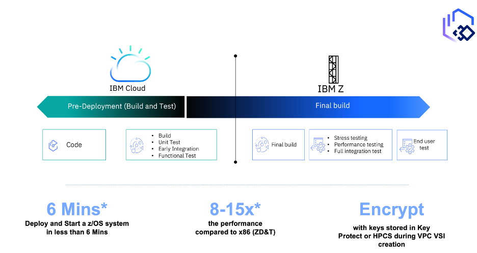

---

copyright:
years: 2023
lastupdated: "2024-03-05"

subcollection: zmodernization-fscloud

keywords:

---

{{site.data.keyword.attribute-definition-list}}

# Wazi as Service - z/OS Dev & Test
{: #waas-intro}

One solution that is making waves in this landscape is “Wazi as a Service.” This cloud-native development and testing environment for z/OS applications is revolutionizing the modernization process by enabling secure DevSecOps practices. With flexible consumption-based pricing, it provides on-demand access to z/OS systems, dramatically improving developer productivity by accelerating release cycles on secure, regulated hybrid cloud environments like IBM Cloud Framework for Financial Services (FS Cloud). Shift-left coding practices allow testing to begin as early as the code-writing stage, enhancing software quality. The platform can be automated through a standardized framework validated for Financial Services, leveraging the IBM Cloud Security and Compliance Center service (SCC). Innovating at scale is made possible with IBM Z modernization tools like Wazi Image Builder, Wazi Dev Spaces on OpenShift, CI/CD pipelines, z/OS Connect for APIs, zDIH for data integrations, and IBM Watson for generative AI.
{: shortdesc}

{: caption="Figure 1. WaaS with z/OS on IBM Cloud" caption-side="bottom"}